# COMP1110 Assignment 1

## Overview
The assignment is based on a simple children's puzzle called
[DINOSAURS – MYSTIC ISLANDS
](https://www.smartgames.eu/uk/one-player-games/dinosaurs-%E2%80%93-mystic-islands),
made by [SmartGames](http://www.smartgames.eu), a producer of
educational games.  The design of the game and all of the imagery in
this assignment comes from their DINOSAURS game.

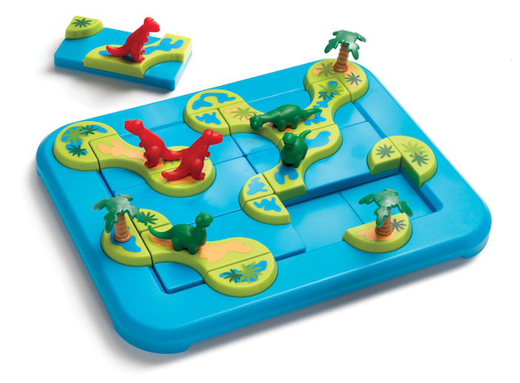

The game is played by rotating and placing six 1x2-sized tiles on a
3x4 grid.  Each tile includes one to three paths, which connect its
nearby tiles to each other or the borders.  Also, there is exactly one
green or red dinosaur on each tile.

## Tiles

The game comprises six 1x2 playing tiles, which we encode using
characters `a` to `f`.  Each tile can be rotated at 90 degree
increments, allowing for 4 different orientations (North, East, South
and West).  The following illustration shows all 24 possible
combinations of the 6 pieces and 4 orientations.

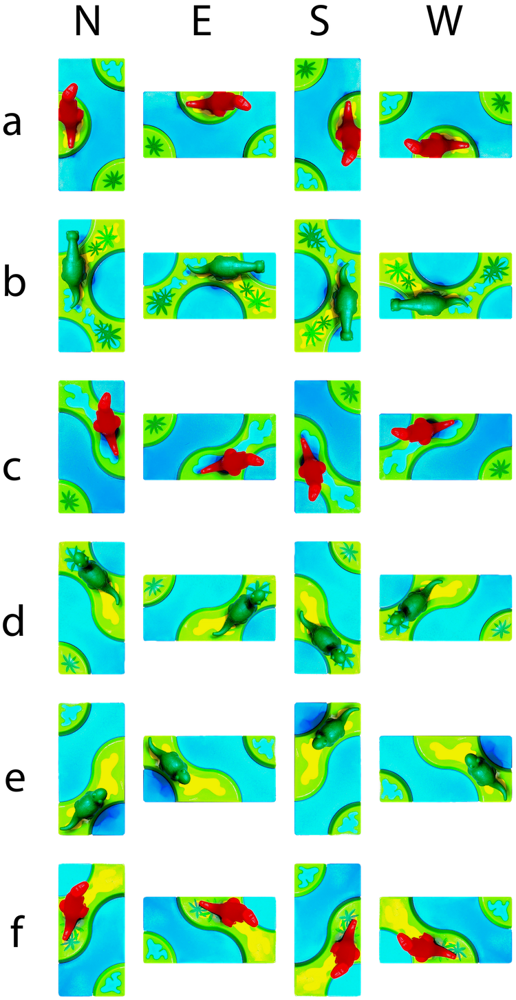

## Objective

The objective of the game is to place the tiles in such a way as to
**create a specified shape of islands** (a *topological* constraint),
with the special requirement that **no dinosaurs of different colors
end up on the same island** (an *ecological* constraint).  Each
objective defines a particular topological constraint (i.e. a
particular arrangement of land and water), and all objectives have the
same ecological constraint (red and green dinosaurs cannot co-exist on
the same island).   The following sample objectives illustrate three
different topological objectives (i.e. three different arrangements of
land and water).   In each case, the player has to determine where to
place tiles such that those topological objectives are met, while also
ensuring the ecological objective is met (red and green dinosaurs
are always separated by water).

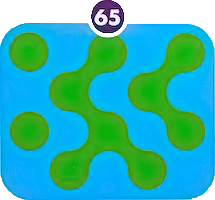 
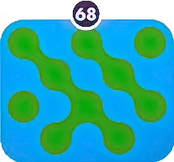
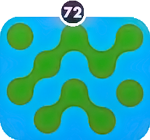

Some objectives include the placement of some of the six tiles,
which makes the objective easier.  A sample objective shape is shown here:

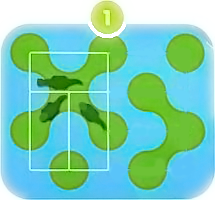

This is objective 1 from the original board game, and is easy to
solve.  The placement of the three green dinosaur tiles has been
specified, so the challenge for the player is just to work out how to
place the red dinosaur tiles correctly.

The game is successfully completed once *all* six tiles are placed
*and* the objective is met.

The game comes with 80 pre-defined objectives, organized as four
difficulty levels from *starter* to *master*.

Each time the game is played, the objective may be different.
Some objectives are easier to solve than others.   The game is designed so
that the player may specify a difficulty level.  In the real game there are 
four difficulty levels, each with twenty different possible objectives.
In our version, the user may select the level of difficulty on a slider.

The images below show a possible progression of the above sample
objective.  Note that the placement of the three green dinosaur tiles
is given in the objective, so the player would normally place those
pieces first, however, the order in which they are placed is
unimportant.  The challenge for the player in this particular case is
just how to place the red dinosaurs in such a way as to satisfy the
objective (since the location of the three green dinosaurs was already
given to the player, in the objective).

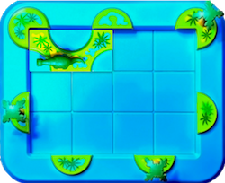 
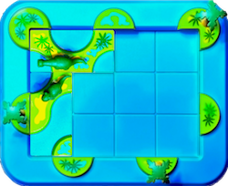
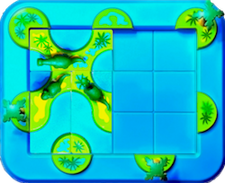
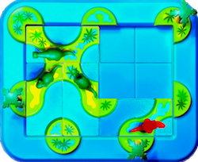
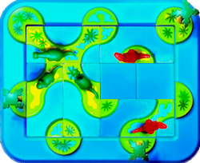
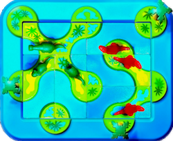

You can find visual representations of all of the objectives in the
`src/comp1110/ass1/gui/assets` [folder](src/comp1110/ass1/gui/assets),
each as a png image, named `<objective number>.png`.

We have provided you with a
[paper version of the game](assets/papergame.pdf), which you can print
out and use to help you visualise the game if you wish.

## Objective Encoding

In our game, the objective of the game is encoded as two strings, one that
represents the direct connections between islands, and another that represents tiles
that are placed at the start of the game (in the example above, the
location of tiles `b`, `d`, and `e` are prescribed by the objective) .
The `Objective` [class](src/comp1110/ass1/Objective.java) has all of
the objectives encoded for you already (they can be seen visually
[here](src/comp1110/ass1/gui/assets)).

### Locations

In our game we encode locations as (x, y) coordinates that refer to
the points on the board where *corners of tiles* may be
located. There are twenty such locations, `(0,0)` through to `(4,3)`,
as shown here:

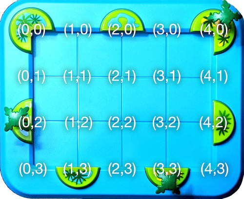

### Island Centers

All game objectives comprise islands that are created by joining
some number of *island centers*, by appropriately placing tiles.
There are exactly ten island centers: seven centered on the board
perimeter, thus visible on the outside of the board, and another three
in the middle of the board (these island centers only become visible
once tiles are placed).  The ten island centers are at locations
`(0,0)`, `(2,0)`, `(4,0)`, `(1,1)`, `(3,1)`, `(0,2)`, `(2,2)`, `(4,2)`,
`(1,3)`, and `(3,3)`, as shown in the figure below:

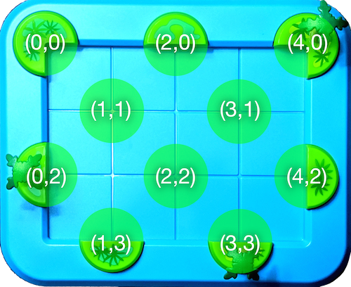

### Encoding of Island Connections

The game objectives are designed such that each objective contains
exactly six direct connections between the ten island centers.

If we consider the  objective 1 again: 

the following pairs of island centers are directly connected:

- `(0,0)` and `(1,1)`,
- `(2,0)` and `(1,1)`,
- `(1,1)` and `(0,2)`,
- `(1,1)` and `(2,2)`,
- `(3,1)` and `(4,2)`,
- `(4,2)` and `(3,3)`

An island connection is encoded as a pair of character tuples, each
tuple representing one of the island centers.

For example, in the connection between `(0,0)` and `(1,1)`, `(0,0)` is
encoded as `"00"`, and `(1,1)` is encoded as `"11"`, and the
connection can be encoded as either `"0011"` or `"1100"`.

All direct connections in the sample objective can be encoded as
`"001120111102112231424233"`, which is a concatenation of six direct island
connections.

Notice that *indirect* connections are not encoded.
For example, in the above objective, there is an indirect connection
between `(0,0)` and `(2,0)` through island center `(1,1)`, but this
indirect connection is not encoded since only *direct* connections
are included in the encoding.

### Encoding of Tile Locations

The location of a tile is encoded as a four-character string, as follows:

0. The tile ID: `a` to `f`
1. The x-coordinate of the top-left corner: `0` to `3`
2. The y-coordinate of the top-left corner: `0` to `2`
3. The orientation of the tile: `N`,`E`,`S` or `W` 

### Encoding of Starting State

A challenge may start with some pre-placed tiles. For example, in the
above sample objective, the location of the tiles with green dinosaurs
is given to the player as part of the objective.

The starting state is encoded as the concatenation of four-character
tile location strings.  Thus the three green dinosaur tiles prescribed
in objective 1, above can be encoded as `"b00We01Sd11N"`,
corresponding to concatenation of three tile placements: `"b00W"`,
`"e01S"`, and `"d11N"`.

### Your task

Unfortunately your version of the assignment has some missing code.
While the graphical user interface is complete, some of the important
logic is missing, so it won't work as described above.  It is your job
to fix the problems, each identified by a `FIXME` comment in the
source code, so that the code works.  Do not change the code except by
following each of the assigned tasks.  When those tasks are completed,
the game will function correctly.  Check your changes by using the
provided unit tests.
